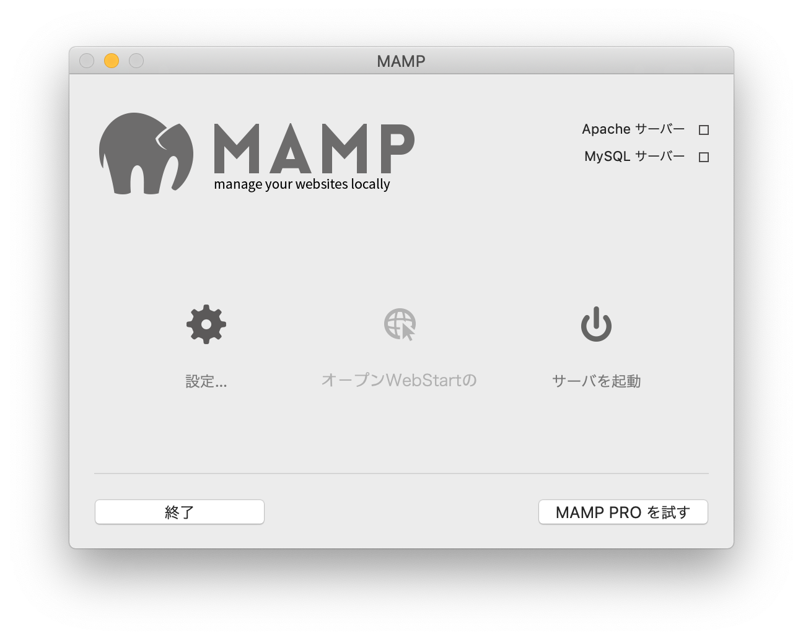
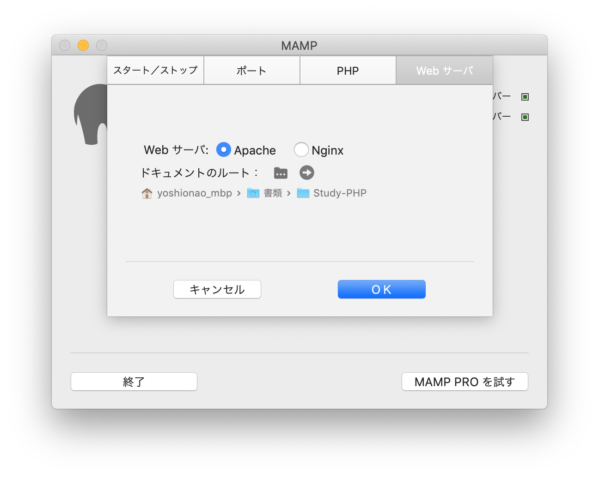
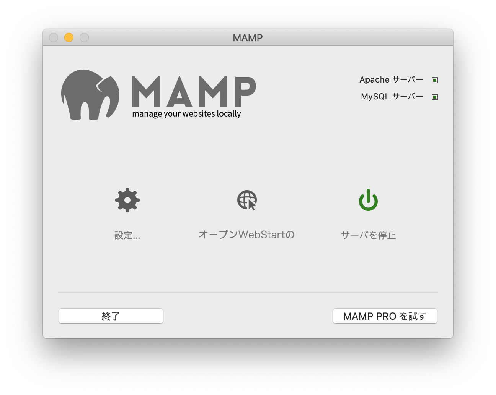

# PHP Dev  


### PHP Develop on MacOS  

MacOS で PHP を書く。  
サーバが必要なので、Apache が入った MAMP.app を使って、サーバを用意する。  


(1) MAMP の設定  
  

(2) MAMP の起動ディレクトリを設定  
  

(3) サーバのスタート  
  


(4) ブラウザで、ローカルホストにアクセス。  
ポートや、PHP のバージョンも MAMP で設定できる。  

[http://localhost:8888/](http://localhost:8888/)  


---  


### PHP Develop on Windows  

PHP のデバッグにはサーバを立てる必要がある。  
サーバを建てる時は、Apache を使う。  
（MAMP、XAMPP がうまくいかなかった）  

Apache の設定は、 C:\var\Apache24\conf\httpd.conf を書き換える。  

起動ディレクトリを、250行目くらいの  
```
DocumentRoot "C:\Users\yoshioca\Documents\Study-threejs-db"
<Directory "C:\Users\yoshioca\Documents\Study-threejs-db">
```
ここに書いておく。  

ブラウザから localhost にアクセスする。  

[http://loalhost:85](http://loalhost:85)  


---  

